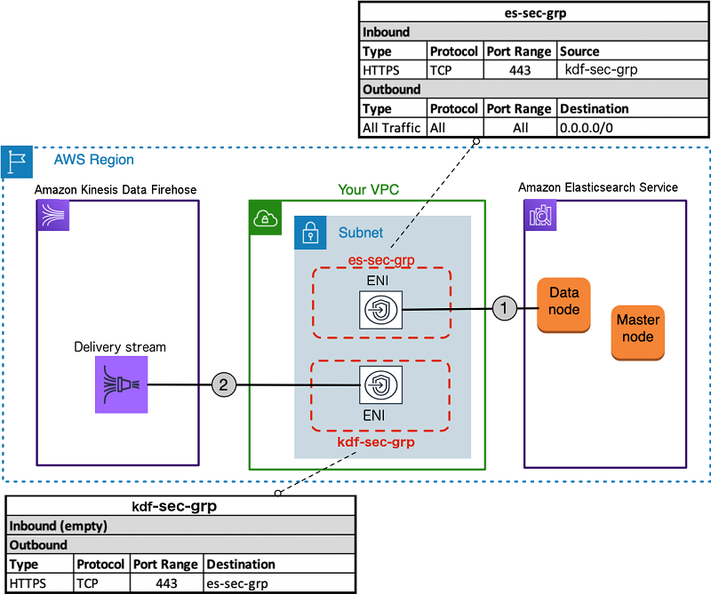

# terraform-aws-kinesis-stream-es

This terraform module can load [streaming data](https://aws.amazon.com/streaming-data/) into your Amazon Elasticsearch Service domain from Amazon Kinesis Data Firehose and Amazon CloudWatch Logs.

You have the option to :

- Create or not a elastisearch domain. If true, will create aws elasticsearch domain.
- Encrypt at rest options. Only available for certain instance types.
- Set the Number of instances in the cluster.
  - The default value is 3
- Set the Instance type of data nodes in the cluster.
  - The default value is "r5.large.elasticsearch"
- Set the Number of Availability Zones for the domain to use with zone_awareness_enabled.
  - Valid values: 2 or 3.
- Set  the Number of dedicated master nodes in the cluster.
  - The default value is 3
- Indicate whether dedicated master nodes are enabled for the cluster.
  - The default value is false
- Set the Instance type of the dedicated master nodes in the cluster.
  - The default value is "m4.large.elasticsearch"
- Set Node-to-node encryption options.
- Set The version of Elasticsearch to deploy.
  - The Default value is 7.4
- Set The size of EBS volumes attached to data nodes (in GB). Required if ebs_enabled is set to true.
- Set The type of EBS volumes attached to data nodes.
  - The default value is "gp2"
- Indicates whether zone awareness is enabled, set to true for multi-az deployment. To enable awareness with three Availability Zones, the availability_zone_count within the zone_awareness_config must be set to 3.
- Enable or not kinesis firehose
- Set The Elasticsearch index rotation period. Index rotation appends a timestamp to the IndexName to facilitate expiration of old data. Valid values are NoRotation, OneHour, OneDay, OneWeek, and OneMonth. The default value is OneDay.
- Set The name of the S3 bucket to store failed documents.


## Usage
```terraform
module "kinesis_stream_es" {
    source = "git::https://github.com/DNXLabs/terraform-aws-kinesis-stream-es.git"

    vpc_id                      = ""
    private_subnet_ids          = ""
    elasticsearch_enabled       = ""
    elasticsearch_domain_name   = ""
    elasticsearch_volume_type   = ""
    elasticsearch_volume_size   = ""
    kinesis_stream_bucket_name  = ""
}
```

When you enable Kinesis Data Firehose data transformation, Kinesis Data Firehose buffers incoming
data up to 3 MB by default. `(To adjust the buffering size, use the ProcessingConfiguration API
with the ProcessorParameter called BufferSizeInMBs.)` Kinesis Data Firehose then invokes the
specified Lambda function asynchronously with each buffered batch using the AWS Lambda synchronous
invocation mode. The transformed data is sent from Lambda to Kinesis Data Firehose. Kinesis Data
Firehose then sends it to the destination when the specified destination buffering size or buffering
interval is reached, whichever happens first.

## Streaming Data into Kinesis Data Firehose
You can load streaming data from CloudWatch Logs to your Kinesis Data Firehose by using a CloudWatch Logs subscription.

```terraform
resource "aws_cloudwatch_log_subscription_filter" "log_subscription_filter" {
  name            = ""
  log_group_name  = ""
  filter_pattern  = ""
  role_arn        = "" # https://docs.aws.amazon.com/firehose/latest/dev/cw-to-delivery-stream.html
  destination_arn = "" # Kinesis ARN
}
```

#### Important
> The Lambda synchronous invocation mode has a payload size limit of 6 MB for both the request
and the response. Make sure that your buffering size for sending the request to the function
is less than or equal to 6 MB. Also ensure that the response that your function returns doesn't
exceed 6 MB.

For data delivery to Amazon ES, Kinesis Data Firehose buffers incoming records based on the
buffering configuration of your delivery stream. It then generates an Elasticsearch bulk request to
index multiple records to your Elasticsearch cluster. Make sure that your record is UTF-8 encoded
and flattened to a single-line JSON object before you send it to Kinesis Data Firehose. Also, the
rest.action.multi.allow_explicit_index option for your Elasticsearch cluster must be set to
true (default) to take bulk requests with an explicit index that is set per record. For more information, see
Amazon ES Configure Advanced Options in the Amazon Elasticsearch Service Developer Guide.

The frequency of data delivery to Amazon ES is determined by the Elasticsearch Buffer size and
Buffer interval values that you configured for your delivery stream. Kinesis Data Firehose buffers
incoming data before delivering it to Amazon ES. You can configure the values for Elasticsearch
Buffer size (1–100 MB) or Buffer interval (60–900 seconds), and the condition satisfied first triggers
data delivery to Amazon ES.

#### Architecture Diagram


[](https://github.com/DNXLabs/terraform-aws-kinesis-stream-es/actions)
[](https://github.com/DNXLabs/terraform-aws-kinesis-stream-es/actions)
[](https://github.com/DNXLabs/terraform-aws-kinesis-stream-es/blob/master/LICENSE)
<!--- BEGIN_TF_DOCS --->

## Requirements

| Name | Version |
|------|---------|
| terraform | >= 0.12.0 |

## Providers

| Name | Version |
|------|---------|
| archive | n/a |
| aws | n/a |
| null | n/a |

## Inputs

| Name | Description | Type | Default | Required |
|------|-------------|------|---------|:--------:|
| elasticsearch\_availability\_zone\_count | (Optional) Number of Availability Zones for the domain to use with zone\_awareness\_enabled. Valid values: 2 or 3. | `number` | `2` | no |
| elasticsearch\_dedicated\_master\_count | (Optional) Number of dedicated master nodes in the cluster. | `number` | `3` | no |
| elasticsearch\_dedicated\_master\_enabled | (Optional) Indicates whether dedicated master nodes are enabled for the cluster. | `bool` | `false` | no |
| elasticsearch\_dedicated\_master\_type | (Optional) Instance type of the dedicated master nodes in the cluster. | `string` | `"m4.large.elasticsearch"` | no |
| elasticsearch\_enabled | If true, will create aws elasticsearch domain. | `bool` | `true` | no |
| elasticsearch\_encrypt\_at\_rest | (Optional) Encrypt at rest options. Only available for certain instance types. | `bool` | `true` | no |
| elasticsearch\_instance\_count | (Optional) Number of instances in the cluster. | `number` | `3` | no |
| elasticsearch\_instance\_type | (Optional) Instance type of data nodes in the cluster. | `string` | `"r5.large.elasticsearch"` | no |
| elasticsearch\_name | The name of the Elasticsearch domain. | `string` | n/a | yes |
| elasticsearch\_node\_to\_node\_encryption | (Optional) Node-to-node encryption options. | `bool` | `true` | no |
| elasticsearch\_version | (Optional) The version of Elasticsearch to deploy. Defaults to 7.4 | `string` | `"7.4"` | no |
| elasticsearch\_volume\_size | The size of EBS volumes attached to data nodes (in GB). Required if ebs\_enabled is set to true. | `number` | `10` | no |
| elasticsearch\_volume\_type | (Optional) The type of EBS volumes attached to data nodes. | `string` | `"gp2"` | no |
| elasticsearch\_zone\_awareness\_enabled | (Optional) Indicates whether zone awareness is enabled, set to true for multi-az deployment. To enable awareness with three Availability Zones, the availability\_zone\_count within the zone\_awareness\_config must be set to 3. | `bool` | `false` | no |
| firehose\_lambda\_processor\_name | n/a | `string` | `"firehose_lambda_processor"` | no |
| kinesis\_firehose\_enabled | If true, will create the AWS kinesis firehose. | `bool` | `true` | no |
| kinesis\_firehose\_index\_name | (Required) The Elasticsearch index name. | `string` | `"kinesis"` | no |
| kinesis\_firehose\_index\_rotation\_period | (Optional) The Elasticsearch index rotation period. Index rotation appends a timestamp to the IndexName to facilitate expiration of old data. Valid values are NoRotation, OneHour, OneDay, OneWeek, and OneMonth. The default value is OneDay. | `string` | `"OneDay"` | no |
| kinesis\_firehose\_name | (Required) A name to identify the stream. This is unique to the AWS account and region the Stream is created in. | `string` | `"kinesis-firehose-es-stream"` | no |
| kinesis\_stream\_bucket\_name | The name of the S3 bucket to store failed documents. | `string` | `"kinesis-logs-stream-backup-bucket"` | no |
| private\_subnet\_ids | n/a | `list` | n/a | yes |
| vpc\_id | n/a | `string` | n/a | yes |

## Outputs

| Name | Description |
|------|-------------|
| kinesis\_arn | The ARN of the kinesis firehose stream to be used in the cloudwatch log subscription filter. |

<!--- END_TF_DOCS --->

## Authors

Module managed by [DNX Solutions](https://github.com/DNXLabs).

## License

Apache 2 Licensed. See [LICENSE](https://github.com/DNXLabs/terraform-aws-kinesis-stream-es/blob/master/LICENSE) for full details.